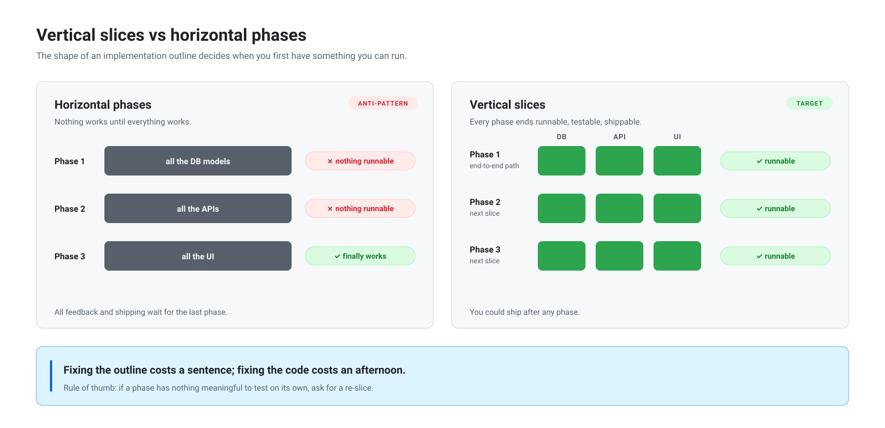

# Visuals

Shared diagram sources for docs and slides. SVG files are the source of truth; light and dark variants share identical geometry.

## Vertical slices vs horizontal phases

Why implementation outlines should be sliced vertically: a horizontal plan (all the DB models, then all the APIs, then all the UI) produces nothing runnable until the very end, while a vertical plan ends every phase at a runnable, testable checkpoint. Fixing the outline costs a sentence; fixing the code costs an afternoon.

<picture>
  <source media="(prefers-color-scheme: dark)" srcset="vertical-slices-vs-horizontal-phases-dark.svg">
  
</picture>

Files:

- [`vertical-slices-vs-horizontal-phases.svg`](vertical-slices-vs-horizontal-phases.svg) — light backgrounds
- [`vertical-slices-vs-horizontal-phases-dark.svg`](vertical-slices-vs-horizontal-phases-dark.svg) — dark backgrounds

Both are self-contained (system font stack, no external assets), so they drop straight into docs. For slide tools that don't import SVG, rasterize at any size, e.g. `qlmanage -t -s 2400 -o . vertical-slices-vs-horizontal-phases.svg`.
